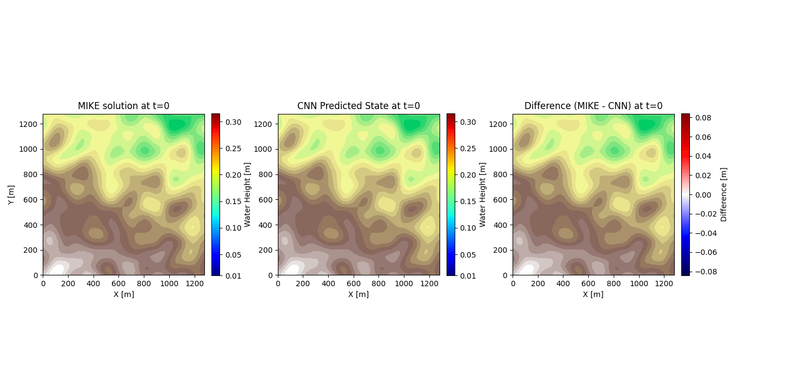
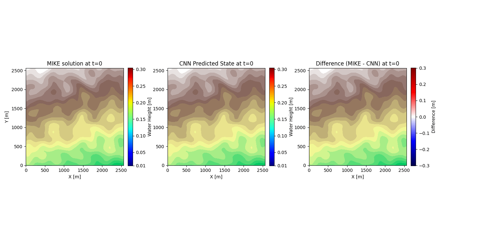
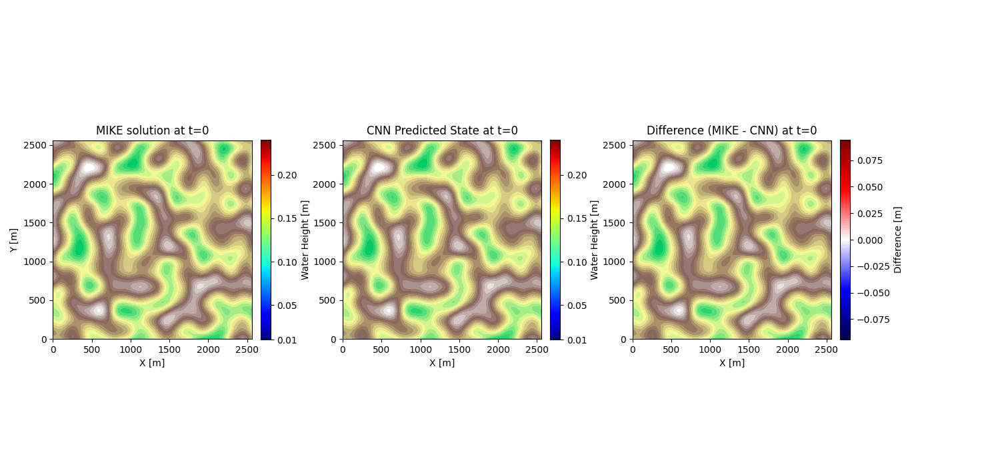

# Simulation Results

## Animations for results show on the poster.
### Video for 15 AR-Step network for event 55313
 
### Video for 15 AR-Step network for event 68370

### Video for 15 AR-Step network for event 69313

More results are coming before poster the poster session 17/9 🌞

Results for applying network with terrain height above minimum to larger domains
**TBA**

## Results for testing on larger domain, for network trained without absolute terrain height as feature.
For these results we chose the best performing network out of a batch of 4, as measured by the validation loss, and mass balance.
We use the three rain events, 55313, 68370 and 69313 from the presentation, and create 3 new 256x256 terrain rasters. However unlike the presentation, the network is evalauted on all 9 rain/terrain combinations. All the networks here we trained using 15 AR-steps since that seemed to be a good value.

### Video for 15 AR-Step network for event 55313 on terrain 1
 
### Video for 15 AR-Step network for event 55313 on terrain 2
 
### Video for 15 AR-Step network for event 55313 on terrain 3
 

### Video for 15 AR-Step network for event 68370 on terrain 1
 
### Video for 15 AR-Step network for event 68370 on terrain 2
 
### Video for 15 AR-Step network for event 68370 on terrain 3
 

### Video for 15 AR-Step network for event 69313 on terrain 1
 
### Video for 15 AR-Step network for event 69313 on terrain 2
 
### Video for 15 AR-Step network for event 69313 on terrain 3
 

